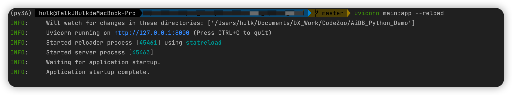

## aidb-python-demo

[AiDB](https://github.com/TalkUHulk/ai.deploy.box) binding to Python Demo :[](https://colab.research.google.com/drive/1gVKxkeIvgrnC56dVQOImyqQqVns-NtkR)


---
[AiDB](https://github.com/TalkUHulk/ai.deploy.box) deployed as the server by fastapi.

## Tested Environment

* Ubuntu 20.04.4 LTS / MacOS
* Python 3.x


## Usage

* Prepare environment

install python3.x、cmake、gcc and so on. All backend libs can download from [AiDB](https://github.com/TalkUHulk/ai.deploy.box)


* Clone AiDB
```asm
git clone https://github.com/TalkUHulk/ai.deploy.box
```


* Compile AiDB library(custom backend)

```asm
cd ai.deploy.box
mkdir build && cd build
cmake -DC_API=ON -DENGINE_ORT=ON -DENGINE_MNN=ON -DENGINE_NCNN=ON  -DENGINE_TNN=OFF -DENGINE_OPV=OFF -DENGINE_PPLite=OFF -DENGINE_NCNN_WASM=OFF -DBUILD_SAMPLE=OFF ../
make -j8
```
generate **libAiDB_C.so** in ai.deploy.box/build/source/ and put it in [lib](.lib)

* prepare files demo need.

download [models](https://github.com/TalkUHulk/ai.deploy.box/releases/download/1.0.0/models-lite.zip) and unzip it in aidb_python_demo then rename models

copy [config](https://github.com/TalkUHulk/ai.deploy.box/tree/main/config) in aidb_python_demo.

copy [extra](https://github.com/TalkUHulk/ai.deploy.box/tree/main/extra) in aidb_python_demo.

**folder structure**
```
aidb_lua_demo/
├── main.py
├── config
    ├── mnn_config.yaml
    ├── ncnn_config.yaml
    .
    .
    .
    └── onnx_config.yaml
├── models
    ├── onnx
    ├── ncnn
    ├── mnn
    ├── tnn
    ├── paddle
    └── openvino   
.
.
.
└── extra
    ├── ppocr_keys_v1.txt
    .
    .
    └── imagenet-1k-id.txt
```

* Run

```asm
uvicorn main:app --reload
```

<p align="center">
 
<p align="center">

* Test

reference [aidb_client.py](aidb_client.py)


